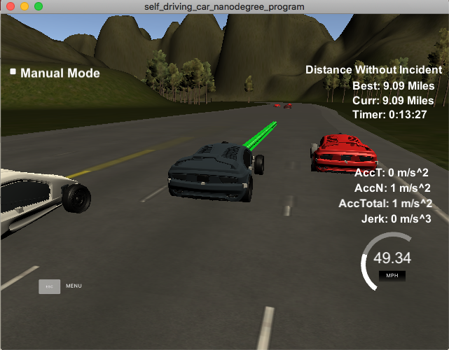
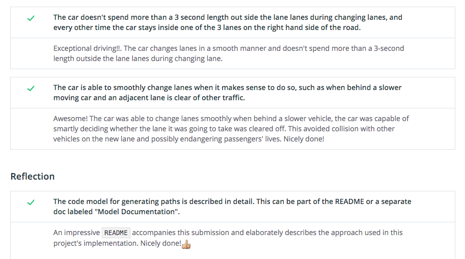

# 无人驾驶(纳米学位)-第二学期-项目2-路径规划
# CarND-Term2-Project2-Path_Planning (C++)

This is the 2nd project in Term 2 for the **Self-Driving Car Engineer** Nanodegree program at [Udacity](https://cn.udacity.com/course/self-driving-car-engineer--nd013)

### Goals
In this project, the goal is to safely navigate a car around a virtual highway with other traffic that is driving +-10 MPH of the 50 MPH speed limit. 

### The project directory structure:
```
root
|   CMakeLists.txt
|   cmakepatch.txt
|   README.md
|   
|___data
|   |   highway_map.csv
|
|___Results
|
|___src
    |   Car.h
    |   cost.cpp
    |   cost.h
    |___Eigen-3.3
    |   helpers.h
    |   json.hpp
    |   main.cpp
    |   plan.cpp
    |   plan.h
    |   prediction.cpp
    |   prediction.h
    |   spline.h
    |   trajectory.cpp
    |   trajectory.h
```

### Running the code
The main program can be built and ran by doing the following from the project top directory. 

1. Make a build directory: `mkdir build && cd build`
2. Compile: `cmake .. && make`
3. Run it: `./path_planning`

I compliled the project on **MacOS 10.14.5 with g++-9**:  
g++-9 (Homebrew GCC 9.2.0_1)  9.2.0

**Note:   
CMakeLists.txt** must include following:
set(sources src/main.cpp src/prediction.cpp src/plan.cpp src/trajectory.cpp src/cost.cpp)


# Implementation Steps
I implemented a pipeline with 3 steps to generate a path (i.e. trajectory) for the car to travel along it.


## Step 1 Prediction
This step is implemented in `prediction.cpp` and `prediction.h`

The function is:  
`map<string, CloseCar> Predict(const vector<vector<double>> &sensor_fusion, double car_s, int prev_size, int lane)`

Since the simulator provides the **car's localization** and **sensor fusion data**,  the function **`Predict()`** takes these data along with previous path length(`prev_size`) and the lane number (`lane`) which was set previously, the function will return a list of cars that are predicted to be closest to my car.

In the funciton I first initialized **min/max metrics** which will be used to check cars' distances, also initialized **6 cars** which represent **closest cars** ahead of/behind my car in each lane (total 3 lanes) at a predicted future timestamp.

With a **loop over the sensor fusion data**, I checked each of other cars on the road, calculated the **speed and future s**(`check_car_s`)of each checked car , and calculated **distance**(`dist`) between that car and my car. (`line #34~#46` in `prediction.cpp`)
```
// predict future s of checked car
check_car_s += ((double) prev_size * 0.02 * check_speed);
// distance to my car
double dist = check_car_s - car_s;
```
Then I used the my car's `lane` and other cars' `d` values to check if the other car is in the same lane as mine , or in the lane on my left/right hand, also used distance metrics to find the closest cars ahead of my car or behind my car. (`line #48 ~ #92` in `prediction.cpp`)

Finally, the function returns the list of closest cars using a map data structure.  I defined a struct to wrap-up data for each car in `Car.h`
```
struct CloseCar
{
    double dist;   // distance between the other car and my car
    double speed;  // speed of the car
};
```

## Step 2 Behavior Planning
Bahavior planning is done after getting the predictions.

This step is implemented in `plan.cpp` and `plan.h`. I created 2 functions:  
- `CarState Plan(const map<string, CloseCar> &predictions, double target_speed, int lane); `  
- `double Update_target_speed(double ahead_dist, double ahead_speed, double target_speed);`

The `Plan()` function implements the main logic of planning. It takes `predictions` from Step 1 and uses `target_speed` and `lane` previously set for the car, the function will **make decisions** for my car to **keep lane** or **change lane**, **speed up** or **slow down**, and return the **updated state** for later path generation.

In `Plan()` function, I first **retrieved closest cars' data** from `predictions`. Then I **checked** if no car will be ahead of my car or the closest car ahead will still be a bit far away, i.e. the distance between the car ahead and my car is larger than `CLOSE_AHEAD`, if so, my car can just **go ahead and speed up** if only the `target_speeed` is not over `MAX_TARGET_SPEED`.

In case that I found a car ahead is within the distance of `CLOSE_AHEAD`, I would calculate costs of 3 options:   
- Keep Lane
- Change to Left Lane
- Change to Rright Lane

The **cost calculations** are implemented in `cost.cpp` and `cost.h`. The functions include:
- `double Calculate_cost(double dist_ahead, double dist_behind, double ahead_speed, double my_speed);`  

- `double Calc_distance_cost(double dist);`
- `double Calc_speed_cost(double ahead_speed, double my_speed);`

The function of `Calc_distance_cost()` punishes the car a lot if the distance is within `BUFFER_DIST` which is set as a safty buffer distance, and calculates the cost as **inverse** of the distance in other cases. 

The function of `Calc_speed_cost()` calculates the cost based on relative values of the closest car ahead of my car and my car's own speed, if car ahead is faster than mine, cost is only related to my car's max possible speed, if car ahead is slower, the cost is higher if my car is faster.

The function of `Calculate_cost()` is to calculate the total weighted cost including distance costs related to both closest car ahead of and car behind my car.

After all 3 options' costs are calculated, I look for the **minimum cost** to make a decision of behavior, and then **update** my car's **state** based on the decision: Keep Lane , Change to Left lane , or Change to Right lane ( `line #73 ~ #99 in plan.cpp `)


I implemented a function `Update_target_speed()` to update the `target_speed` that my car will follow. It will set `target_speed` based on distance to closest car ahead (`ahead_dist`) and speed of that car (`ahead_speed`) to avoid collision and let my car go as close as possible to the 50 MPH speed limit or slow down,  considering `MAX_TARGET_SPEED` and max acceleration `MAX_SPEED_CHANGE`.

I defined a struct to wrap-up data for my car's state in `Car.h`
```
// My car's state for planning 
struct CarState
{
    int lane;
    double target_speed;

    bool ChangeLane;
};
```

## Step 3 Trajectory Generation
This step is implemented in `trajectory.cpp` and `trajectory.h`. 

The function is:  
`vector<vector<double>> Generate_Trajectory(const MyCar &my_car, const CarState &car_state, 
                         const MapWayPoints &map_waypoints, const PreviousPath &previous_path)`


The function takes **my car's data** (provided by simulator) and the **car's state**, which was updated from Step 2, as well as a **map list of waypoints** and **previous path's data**. 

In this function, I retrieved my car's data,using a struct `MyCar` defined in `Car.h`,  which is to ease the parameter passing.

I set **a list of widely spaced (x, y) points** , starting with a couple of previous path's points if there is a previous path, to make transition more smooth.(`line #43 ~ #73 trajectory.cpp`)

The list also includes 3 points further along the way starting from the end of previous path or the initial car's position, using `getXY()` function defined in `helpers.h` to find the points' map/global coordinates (`line #75 ~ #84 trajectory.cpp`)

These points are then converted to **car's local coordinates**, taking the car's position as the reference origin(`ref_x, ref_y, ref_yaw`) of the coordinates system. (`line #86 ~ #95 trajectory.cpp`)

In order to create smooth trajectories, I used a **spline function** defined [here]( http://kluge.in-chemnitz.de/opensource/spline/), the spline function is in a single hearder file and really easy to use.

In order to let car travel at desired reference velocity (`target_speed`), I did calculations in car coordinates to break up spline points evenly. (`line #108 ~ #119 trajectory.cpp`)

Finally, a new path (trajectory) is generated by first filling it with whatever left from previous path, then with the points in the spline (`line #102 ~ #106 , #121~#135 trajectory.cpp`) 

## Important parameters


## My Running Results
The car is able to make one complete loop around the 6946m highway (the longer record was up to 12.5 miles). It can pass slower traffic when possible, and avoid hitting other cars as well as driving inside of the marked road lanes, unless going from one lane to another.




# Environment Setup
The project involves the Term 3 Simulator which can be downloaded [here](https://github.com/udacity/self-driving-car-sim/releases/tag/T3_v1.2)

To run the simulator on Mac/Linux, first make the binary file executable with the following command:
```shell
sudo chmod u+x {simulator_file_name}
```

#### Clarifications about data
#### The map of the highway is in data/highway_map.txt
Each waypoint in the list contains  [x,y,s,dx,dy] values. x and y are the waypoint's map coordinate position, the s value is the distance along the road to get to that waypoint in meters, the dx and dy values define the unit normal vector pointing outward of the highway loop.

The highway's waypoints loop around so the frenet s value, distance along the road, goes from 0 to 6945.554.

Here is the data provided from the Simulator to the C++ Program

#### Main car's localization Data (No Noise)

["x"] The car's x position in map coordinates

["y"] The car's y position in map coordinates

["s"] The car's s position in frenet coordinates

["d"] The car's d position in frenet coordinates

["yaw"] The car's yaw angle in the map

["speed"] The car's speed in MPH

#### Previous path data given to the Planner

//Note: Return the previous list but with processed points removed, is a nice tool to show how far along
the path has processed since last time. 

["previous_path_x"] The previous list of x points previously given to the simulator

["previous_path_y"] The previous list of y points previously given to the simulator

#### Previous path's end s and d values 

["end_path_s"] The previous list's last point's frenet s value

["end_path_d"] The previous list's last point's frenet d value

#### Sensor Fusion Data, a list of all other car's attributes on the same side of the road. (No Noise)

["sensor_fusion"] A 2d vector of cars and then that car's [car's unique ID, car's x position in map coordinates, car's y position in map coordinates, car's x velocity in m/s, car's y velocity in m/s, car's s position in frenet coordinates, car's d position in frenet coordinates. 


## Dependencies

* cmake >= 3.5
  * All OSes: [click here for installation instructions](https://cmake.org/install/)
* make >= 4.1
  * Linux: make is installed by default on most Linux distros
  * Mac: [install Xcode command line tools to get make](https://developer.apple.com/xcode/features/)
  * Windows: [Click here for installation instructions](http://gnuwin32.sourceforge.net/packages/make.htm)
* gcc/g++ >= 5.4
  * Linux: gcc / g++ is installed by default on most Linux distros
  * Mac: same deal as make - [install Xcode command line tools]((https://developer.apple.com/xcode/features/)
  * Windows: recommend using [MinGW](http://www.mingw.org/)
* [uWebSockets](https://github.com/uWebSockets/uWebSockets)
  * Run either `install-mac.sh` or `install-ubuntu.sh`.
  * If you install from source, checkout to commit `e94b6e1`, i.e.
    ```
    git clone https://github.com/uWebSockets/uWebSockets 
    cd uWebSockets
    git checkout e94b6e1
    ```

# Pass Certificate



